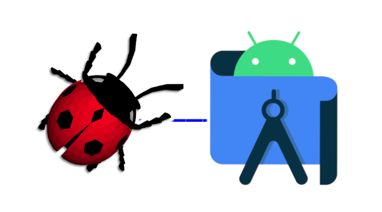

  

<h1 align="center">FTCSimulator</h1>

This is a cross-platform simulator for First Tech Challenge robots created by Team 6448 (Jesuit Blue Jays).  The FTC Simulator acts as a bridge between the Qualcomm API used by the FTC Android app and the Webots open source simulator. You can find more information on:
 

[FTCSimulator website](https://ftcsimulator.com)  

[Documentation](https://docs.ftcsimulator.com)

## Getting Started With Webots

### Using the provided Webots world

1. Download Webots from their [Github release](https://github.com/cyberbotics/webots/releases/tag/R2021b). The sample world we provide requires Webots 2021b or earlier and is not compatible with newer versions.
2. Rename `simulation.properties.example` to `simulation.properties` and edit the file to add the full path to your Android Studio project.
3. Open Webots and then open the sample world located at `SampleWebotsProject/worlds/gobilda - freight.wbt`.
4. Profit.

### Using your own Webots world

1. Download Webots from their [Github release](https://github.com/cyberbotics/webots/releases/tag/R2021b). The sample world we provide requires Webots 2021b or earlier and is not compatible with newer versions.
2. Download FTCController.jar and SimulatorSupport.jar from the [release](https://github.com/BlueJays6448/FTCSimulator/releases/tag/0.1).
3. Download the sample webots project.
4. Add the FTCController.jar to `SampleWebotsProject/controllers/FTCController`.
5. Rename `simulation.properties.example` to `simulation.properties` and edit the file to add the full path to your Android Studio project.
6. Launch your Webots world.

You can find more information about getting started with Webots [here](https://docs.ftcsimulator.com/getting-started/getting-started-with-webots).

## Advanced

- To make your simulated robot behave as close as possible to a real robot, add the SimulatorSupport.jar to your Android Studio project and use its methods to make the simulator behave similar to the real world.  
- Use the properties file to map motors and convert Webots motors to Servos and Continuos Rotation Servos.

## Android Studio

### Using non-Android Studio code

1. Export the code from your IDE.
2. Create an Android Studio project, and add your code into it.
3. Build the project.

### Using the sample Android Studio project

1. Make sure that the configuration file points to the full path of the Android Studio project.
2. Build the sample code.

You can find more information about getting started with Android Studio [here](https://docs.ftcsimulator.com/getting-started/getting-started-with-android-studio).

## Important Note

- The sample world is designed for Webots R2021b or earlier.  The coordinate system was changed with release R2022A, and the sample world is not compatible.  The sample world will be updated for the new coordinate system after the competition season.  Download R2021b from this link: <https://github.com/cyberbotics/webots/releases/tag/R2021b>

## Freight Frenzy World

